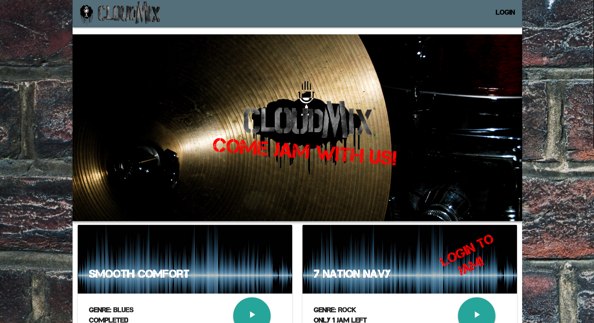

## Cloud-Mix

  
<b>This app is a platform for online musicians, songwriters, and producers to come together and mash up a quick jam session to create a song communally.</b>

<b>To get the app started, fork and clone the repo. Once done, run</b>
<code>npm install</code> <b>then</b>
<code>npm run startmon</code> <b>in one terminal window
and run</b> <code>npm run compile</code> <b>in another terminal window</b>

## Requirements For Working With The Project

- Elephant SQL (Pretty Panda Tier Recommended)
- Latest Version Of Node, Google Chrome and React

Lead Developer: <a href="https://www.github.com/dsousadev">David de Sousa</a>

Product Owner: <a href="https://www.github.com/Hugodol">Hugo Dolemieux</a>

Scrum Master: <a href="http://alex1100.software">Alex Raffe Aleksanyan</a>

<b>Technologies</b>
- Node.js
- React.js
- React Router
- PostgreSQL
- Sequelize
- Dotenv
- React-Materialize
- Howler.js
- Web Audio API
- Axios
- Express
- WaveSurfer

- Webpack
- Bcrypt
- Nuka-Carousel
